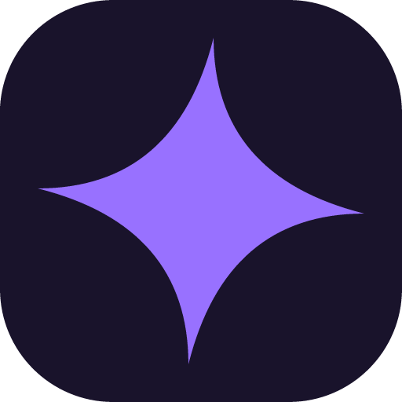
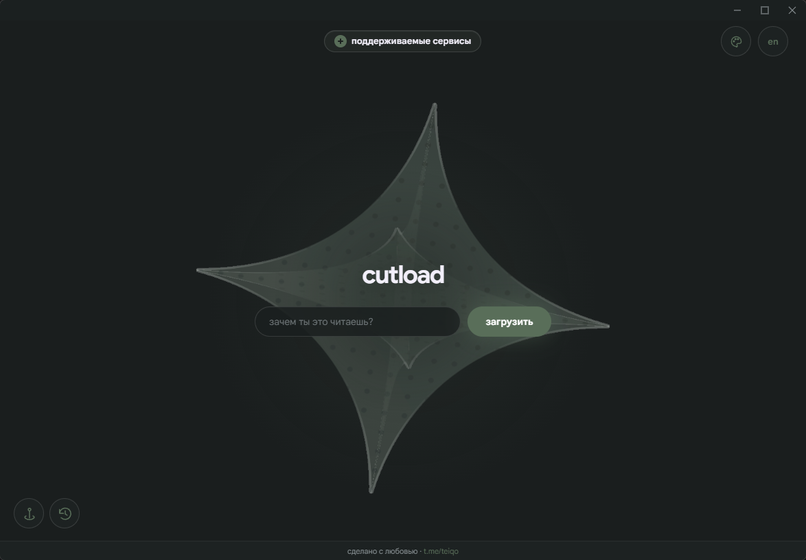

<p align="center">
  
</p>

# cutload

приложение для Windows, которое скачивает видео и аудио по ссылке прямо на компьютер. интерфейс на TypeScript и WebGL, оболочка Tauri 2, локальный загрузчик на Rust с yt-dlp и FFmpeg.

<p align="center">
  
</p>

## возможности

- выбор качества, формата и кодека, извлечение аудио и обрезка фрагмента.
- предпросмотр обложки и кадров, прогресс, отмена и история загрузок.
- собственное оформление окна, темы, Liquid Glass и режим производительности.
- локальная работа без отдельного облачного сервера.

## запуск

нужны Node.js, Rust с Windows MSVC toolchain, Visual C++ Build Tools и WebView2.

```powershell
npm ci
powershell -File scripts/prepare-binaries.ps1
npm run desktop
```

`npm run package` собирает установщик NSIS.

перед запуском `prepare-binaries.ps1` установи yt-dlp и FFmpeg и добавь их в `PATH`. скрипт копирует инструменты в `src-tauri/binaries`; сами бинарные файлы, скачанные видео, зависимости и результаты сборки в Git не входят.

для работы в браузере запускай `npm run browser`, затем открывай http://127.0.0.1:5174/. эта команда запускает интерфейс и локальный Rust-загрузчик вместе. реальные файлы сохраняются в выбранную папку на компьютере; выбор папки открывает системный диалог. изменения интерфейса обновляются автоматически. после изменения Rust перезапусти команду. `npm run dev` запускает только интерфейс; для скачивания рядом должен работать загрузчик.

## архитектура

- `frontend/runtime/bridge.ts`: типизированные команды и события Tauri.
- `frontend/runtime/main.ts`: связь дизайна с реальными данными и управлением окном.
- `src-tauri/src/media.rs`: анализ ссылки и нормализация метаданных.
- `src-tauri/src/jobs.rs`: одна загрузка одновременно, прогресс, отмена и конвертация.
- `src-tauri/src/tools.rs`: безопасный запуск инструментов без shell, проверка ссылок и имён файлов.
- `src-tauri/src/browser.rs`: локальный мост для разработки через браузер, тот же Rust-код загрузок. слушает только 127.0.0.1:5175, проверяет Origin и Host, использует случайный токен сессии. в установленной сборке HTTP-мост не запускается.
- существующие файлы дизайна пока сохранены отдельно. их постепенный перенос в модули не должен менять внешний вид.

## готово

окно без системной шапки, собственные кнопки окна и перетаскивание; реальные метаданные yt-dlp; выбор папки; загрузка видео/аудио; конвертация выбранных кодеков; прогресс и отмена дерева процессов Windows; сохранение без перезаписи существующего файла.

## текущие ограничения

- видео: при включении фрагмента FFmpeg получает 9 настоящих кадров, при наведении уточняет кадр выбранной секунды. метаданные и шкала кешируются на две минуты; адрес потока повторно используется из метаданных. аудиоволна пока декоративная.
- правый клик по обложке или шкале видео открывает скачивание в корень проекта. этот пункт предназначен для режима разработки; в установленной версии используется выбранная папка скачивания.
- фрагмент сначала скачивает исходный файл целиком, затем обрезается FFmpeg. режим original режет по ключевым кадрам; точная обрезка требует перекодирования.
- для некоторых сайтов нужна авторизация — управление cookies ещё не реализовано.
- для YouTube нужен поддерживаемый JavaScript runtime и совместимая версия yt-dlp. управляемая установка и обновления этого runtime — следующий этап; пользовательская установка Node.js не включается в дистрибутив автоматически.
- Google Sans включён в ресурсы приложения; лицензия находится в `frontend/assets/fonts/OFL-GoogleSans.txt`.
- внешние инструменты требуют проверки лицензий выбранных сборок перед публичным выпуском. автообновление и подпись установщика ещё не подключены.

## проверка

`npm run build`, `cargo test --manifest-path src-tauri/Cargo.toml`, затем реальный сценарий анализа, скачивания короткого видео и отмены.

при первом скачивании интерфейс запрашивает папку и запоминает выбор. последние 50 успешных загрузок хранятся в `downloads.json` в каталоге данных приложения. кнопки истории открывают файл в системном плеере или выделяют его в проводнике; удалённые и перемещённые файлы показывают понятную ошибку.

## проект на github

[](https://github.com/teiqo/cutload/stargazers)
[](https://github.com/teiqo/cutload/issues)
[](https://github.com/teiqo/cutload/commits/main)
[](https://github.com/teiqo/cutload/tree/main)

[сообщить об ошибке](https://github.com/teiqo/cutload/issues/new) · [исходники](https://github.com/teiqo/cutload/tree/main) · [история изменений](https://github.com/teiqo/cutload/commits/main)
